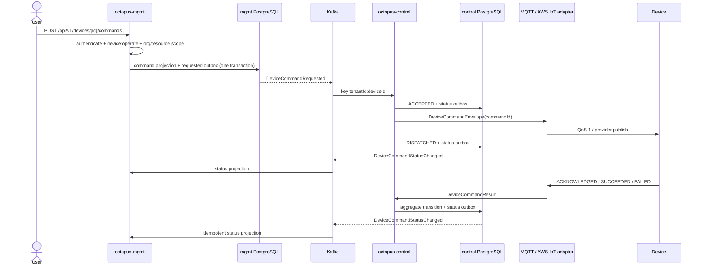

# Device command lifecycle and reliability

## Ownership and flow



`octopus-mgmt` owns user authorization, organization/resource scope and the tenant-facing
audit projection. `octopus-control` owns provider delivery and execution state. Each service
has an independent database; contracts live in `octopus-api-control`.

## State machine

```text
ACCEPTED -> DISPATCHED -> ACKNOWLEDGED -> SUCCEEDED
    |          |               |
    +----------+---------------+-----> FAILED
    +----------+---------------+-----> EXPIRED

DISPATCHED -> SUCCEEDED is allowed for devices that return a terminal result directly.
```

Every durable time is UTC `Instant`/`timestamptz`. TTL is evaluated against the result's
`occurredAt`; a result at or after `expiresAt` transitions the command to `EXPIRED`. Duplicate
ACK and terminal results are idempotently ignored. Results whose tenant, device or command
does not match the MQTT topic/aggregate are rejected without broker acknowledgement.

## Delivery guarantees

- Management inserts the command request and Kafka outbox row atomically.
- Control consumes one record at a time under tenant context. The Kafka record is acknowledged
  only after the control database transaction and provider call complete.
- Status events use a transactional outbox. A monotonic database relay sequence plus a
  PostgreSQL transaction advisory lock permits only one relay publisher per service cluster,
  preserving insertion order before Kafka partition ordering takes over.
- Kafka keys are `{tenantId}:{deviceId}` so commands and status events for one device stay in
  one partition. Different devices remain parallel.
- Inbox/event IDs and optimistic aggregate versions make replay safe.

The end-to-end guarantee is **at least once**, not exactly once. If a process crashes after
MQTT/AWS IoT accepts a publish but before the database transaction commits, Kafka redelivery
can publish the command again. Every device protocol must therefore treat `commandId` as a
persistent idempotency key. Prefer returning the previously stored result for duplicate IDs.

Desired Shadow updates reuse this pipeline with operation `shadow.desired.patch`. Their
command terminal success means the operation executed, not that reported state converged;
`APPLIED` is a separate management projection transition driven by a matching reported
Shadow and `appliedDesiredVersion`.

## Operational rules

- Keep `OCTOPUS_COMMAND_DISPATCH_ENABLED=false` until the provider, control PostgreSQL and
  result subscription are healthy.
- Provision requested/status topics explicitly; production replication factor should be at
  least three with `min.insync.replicas` at least two.
- Alert on command age by state, outbox pending age/attempts, Kafka consumer lag, provider
  publish latency, invalid result topics, and expiry rate.
- Retain the management status inbox at least as long as the Kafka replay window.
- Do not retry non-idempotent provider APIs unless `commandId` is preserved end to end.
